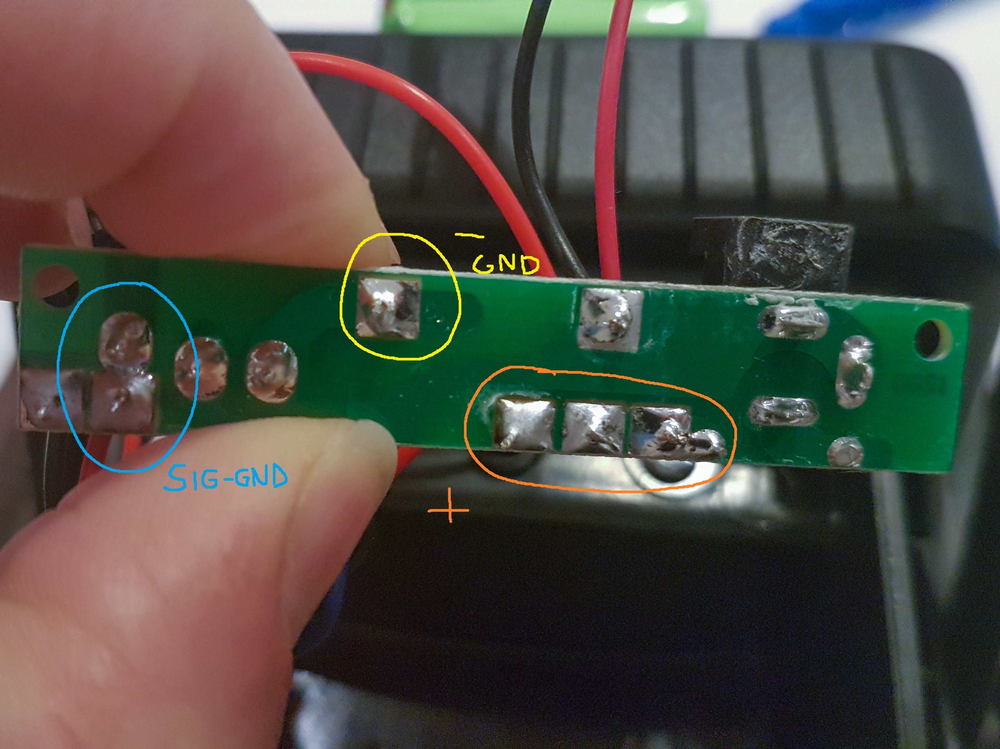

= wARLUX: WiFi for ARLUX
:author: Julien Morat
:email: julien.morat@gmail.com
:sectnums:
:toc:
:toclevels: 1
:experimental:

== Brief
The hack adds Wifi capability (ESP32) and signal through MQTT a motion event
to a solar exterior light. In short, the projector is triggered when motion is detected.
The inserted ESP32 catches the event and send a signal through WiFi + MQTT.
This MQTT event can then be handled by  my favorite automation software (home assistant).

.LED projector with motion sensor
image:assets/animation.gif[width=600]

Required hardware:

- level-0 in soldering
- the motion-triggered lamp
- ESP32 board
- 3 cables

Required software:

- arduino IDE
- ESP32 library for arduino IDE

== Source code

source code: link:warlux.ino[warlux.ino]

== Assembly

 . unscrew the back plate (fig. 1)
 . unplug the battery
 . unscrew everything inside until you free the electronic plate (fig. 2)
 . turn the plate to uncover the other side, and identify *+*, *GND* and the *signal*.
 . solder your 3 cables to the ESP32 (fig. 5)
   - *orange* is *VIN*
   - *yellow*red* is *GND*
   - *blue* is GPIO 033
 . solder your 3 cables to the projector (fig. 6)
    - *+*: orange
    - *ground*: yellow
    - *signal*: blue
 . put every thing back in place

.fig. 2: back plate

.fig. 3: the electronic plate
image:assets/03.jpg[width=600]

.fig. 4: the 3 slots

.fig. 5: soldering ESP32
image:assets/05.jpg[width=600]

.fig. 6: soldering LED projector

